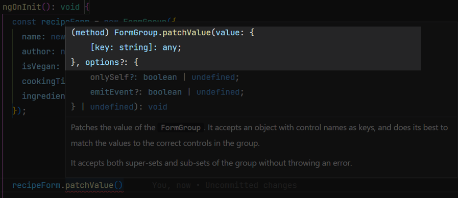
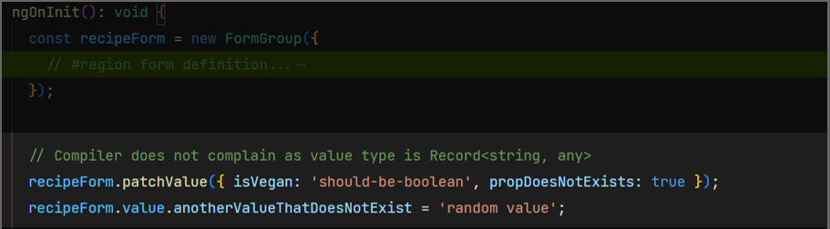
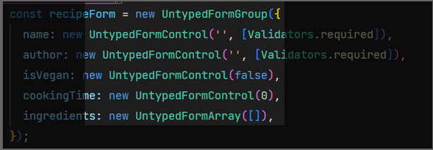
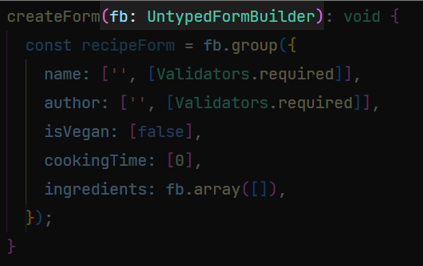
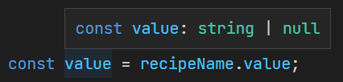
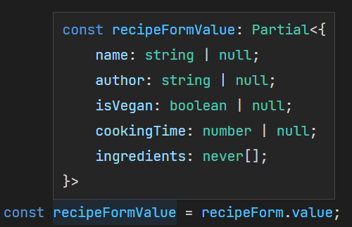
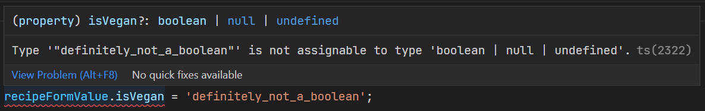
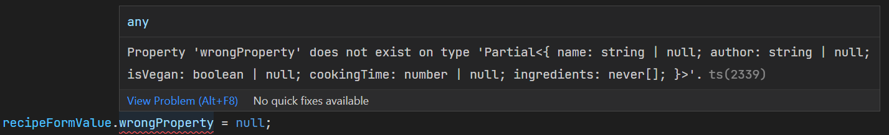

# Angular strictly-typed forms

In this article we will take a look to the brand-new Angular's typed forms, shipped with version 14 of the framework. We will walk first through the problems encountered with untyped forms, then we'll se how the angular team have been addressed such problems and defined a path to guide developers towards a full-typed forms transition.

## A bit of history

Since the very first versions of Angular 2+, the framework has offered a programmatically support to form handling called *"Reactive Forms"*. With this approach, developers have had a declarative way to define a form model / validators in the code-side of a component and got a reactive-based support to observe form value / status transitions. Here is a basic reactive form declaration example:

>```typescript
>  createForm(): void {
>    const recipeForm = new FormGroup({
>      name: new FormControl('', [Validators.required]),
>      author: new FormControl('', [Validators.required]),
>      isVegan: new FormControl(false),
>      cookingTime: new FormControl(0),
>      ingredients: new FormArray([]),
>    });
>  }
>```

### Reactive forms: An untyped story

Despite its powerful APIs, reactive forms have always been poorly typed. As we can see, the internal model is resolved to a generic untyped map of key-value pairs:



Furthermore, it is possible to set invalid values or access non-existent properties of the form model, without any compiler complaint:



This lack of constraints is dangerous and error-prone, especially in a real-world scenario where forms are big and referenced across a wide range of components; furthermore the codebase is often maintained by many developers and the possibility write a typo in a model property or to assign of a wrong value is very high and can lead to errors.

### ng@14: Types to the rescue!

The situation described in the previous paragraph made the Angular typed forms support the top #1 feature request and so remained for a long time, until it finally landed with version 14 of the framework. It is worth saying that such feature is also a breaking change because _FormGroup_, _FormArray_ and _FormControl_, that were untyped in older versions, have changed their behavior in order to be strictly typed. Fortunately, Angular guys made an excellent job to guarantee a seamless upgrade by running an automatic migration of the legacy forms to the brand new classes _UntypedFormGroup_, _UntypedFormArray_ and _UntypedFormControl_ (and _UntypedFormBuilder_ helper class).

The upgrade of angular is as simple as the following command:
```sh
$ ng update @angular/cli@14
```

After the upgrade process we can see how our form declaration has been automatically modified in order to keep the application working:

>

In a similar way, if a form was previously created by means of the _FormBuilder_ helper class it is modified as well in order to maintain backward compatibility:

>

## welcome to my (typed) world
After having covered the upgrade process from an older version, we can now take a dive on how Angular Forms ecosystem has been improved to provide a full-typed developer experience.

We start from the _FormControl_, the most basic part of a form:

>```typescript
>const recipeName = new FormControl('', [Validators.required]);
>```
The above snippet shows the creation of a string control (because we are giving an empty string as the default value). Here is how typescript infers the type to its value: 

>

That is _string_ (the type of the given value) and _null_, since a control value is nullable by default unless other options are specified (see later paragraph for further information).

Going forward, let's check out how our recipe model is typed after changing its definition to a typed _FormGroup_. We can now remove the _Untyped_ class reference and restore the original recipe form:

>```typescript
>  createForm(): void {
>    const recipeForm = new FormGroup({
>      name: new FormControl('', [Validators.required]),
>      author: new FormControl('', [Validators.required]),
>      isVegan: new FormControl(false),
>      cookingTime: new FormControl(0),
>      ingredients: new FormArray([]),
>    });
>
>    const recipeFormValue = recipeForm.value;
>  }
>```

This is how the form value is inferred:

>

We can see that each property of the resulting object reflects the information given inside its corresponding _FormControl_; Furthermore, it is no longer possible to write typos or set invalid value, as typescript compilation would break: 

>

>

In this way we can prevent possible runtime errors, saving a lot of headaches.

**NOTE:** It is worth pointing out that is still possible to declare a form with a _FormBuilder_ .....


---
---
---

_description of the form after the full process of migration with both formGroup and formBuilder and how angular leverages typescript's type inference._

### Form declaration: a common oversight - TODO
_description of the type loss when a typed form is wrongly declared (show untyped, inline-typed, custom type)._

### Nullability management - TODO
_description of the three ways to declare manage nullability of a form field._

### Upgrade at your own pace - TODO
_description of the process of incremental conversion of a form_

### New feature: FormRecord - TODO
_Show use case and the difference with standard formGroup._


## Conclusion - TODO
_Angular typed forms is a feature which the community awaited for long and now that is landed..._