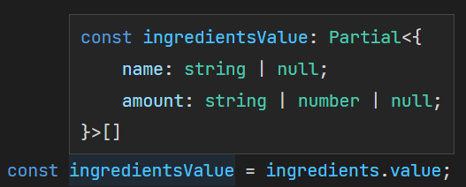
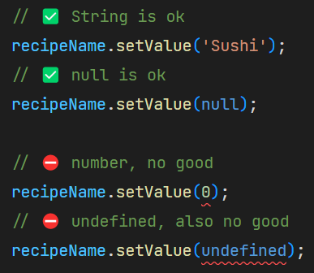
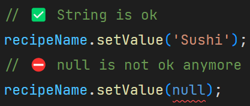

# Angular strictly-typed forms

In this article we will take a look to the brand-new Angular's typed forms, shipped with version 14 of the framework. We will walk first through the problems encountered with untyped forms, then we'll se how the angular team have been addressed such problems and defined a path to guide developers towards a fully-typed forms management.

Please also check out the official [angular typed forms](https://angular.io/guide/typed-forms) documentation page.

## A bit of history

Since the very first versions of Angular 2+, the framework has offered a programmatically support to form handling called *"Reactive Forms"*. With this approach, developers have had a declarative way to define a form model and validators in the code-side of a component and got a reactive-based support to observe form value / status transitions. Here is a basic reactive form declaration example:

>```typescript
>  createForm(): void {
>    const recipeForm = new FormGroup({
>      name: new FormControl('', [Validators.required]),
>      author: new FormControl('', [Validators.required]),
>      isVegan: new FormControl(false),
>      cookingTime: new FormControl(0),
>      ingredients: new FormArray([]),
>    });
>  }
>```

### Reactive forms: An untyped story

Despite its powerful APIs, reactive forms underlying model have always been poorly typed. As we can see from the following picture, the internal form model is resolved to a generic untyped map of key-value pairs:


Furthermore, it is possible to set invalid values or access non-existent properties of the form model, without any compiler complaint:


This lack of constraints is dangerous and error-prone, especially in a real-world scenario where forms are big and referenced across a wide range of components; furthermore the codebase is often maintained by many developers and the possibility write a typo in a model property or to assign of a wrong value is very high and can lead to errors.

### ng@14: Types to the rescue!

Because of the situation described in the previous paragraph, the request for Angular typed forms support was the top #1 feature request for a long time, until it finally landed with version 14 of the framework. It is worth saying that such feature is also a breaking change because _FormGroup_, _FormArray_ and _FormControl_, that were untyped in older versions, have changed their behavior in order to be strictly typed. Fortunately, Angular guys made an excellent job to guarantee a seamless upgrade by running an automatic migration of the legacy forms to the brand new classes _UntypedFormGroup_, _UntypedFormArray_ and _UntypedFormControl_ (and _UntypedFormBuilder_ helper class).

The upgrade of angular is as simple as the following command:
```sh
$ ng update @angular/cli@14
```

After the upgrade process we can see how our form declaration has been automatically modified in order to keep the application working:

>

In a similar way, the forms previously created by means of the _FormBuilder_ helper class are modified as well in order to maintain backward compatibility:

>

In this situation, any developer has the possibility to install the latest angular version without breaking anything and plan in a later moment a gradual conversion of the application to the new typed form ecosystem.

## welcome to my (typed) world
After having covered the upgrade process from an older version, we can now take a dive on how Angular Forms ecosystem has been improved to provide a fully-typed developer experience.

We start from the _FormControl_, the most basic part of a form:

>```typescript
>const recipeName = new FormControl('', [Validators.required]);
>```
The above snippet shows the creation of a string control (because we are giving an empty string as the default value). Here is how typescript infers the type to the control's value: 

>

That is _string_ (the type of the given value) and _null_, since a control value is nullable by default unless other options are specified (see later paragraph for further information).

Going forward, let's check out how our recipe model is typed after changing its definition to a typed _FormGroup_. We can now remove the _Untyped_ class reference and restore the original recipe form:

>```typescript
>  createForm(): void {
>    const recipeForm = new FormGroup({
>      name: new FormControl('', [Validators.required]),
>      author: new FormControl('', [Validators.required]),
>      isVegan: new FormControl(false),
>      cookingTime: new FormControl(0),
>      ingredients: new FormArray([]),
>    });
>
>    const recipeFormValue = recipeForm.value;
>  }
>```

This is form's value is inferred:

>

We can see that every property of the resulting object reflects the information given inside its respective _FormControl_; Because of this it is no longer possible to write typos or set invalid value, as typescript compilation would break: 

>

>

In this way we can prevent possible runtime errors, saving a lot of headaches.

**NOTE:** It is worth pointing out that if the form was created with the _FormBuilder_ instead a _FormGroup_ it would have had the same behavior and type support.

Finally, let's see the resulting value given by a _FormArray_: For example we are creating an ingredient list whose elements are objects containing a string _name_ and an amount that can be both string or number:

>```typescript
>    const ingredients = new FormArray([new FormGroup({
>      name: new FormControl('', [Validators.required]),
>      amount: new FormControl<string | number>('', [Validators.required]),
>    })]);
>```

and here is how the type of resulting value is resolved:

>

That corresponds exactly the type defined inside the ingredients _FormArray_.

### Nullability management

As stated in a previous chapter, each form control is nullable by default. It means that in a strictly typed typescript environment it can only assume a value compatible with the declared type or _null_. For example, our _recipeControl_ declared as nullable string:

>```typescript
>const recipeName = new FormControl('', [Validators.required]);
>```

can only accept a _string_ or _null_:

>

Also, the null value is assigned to the control when calling _reset_ (if no explicit value is passed to the method):

>```typescript
>    // ❗this assigns the null value
>    recipeName.reset();
>```

There are two possible ways to make a control non-nullable, it's up to the developer to choose the best depending on the specific use case. Here is the available choices:

- Setting explicitly _nonNullable_ attribute inside the control definition options:
>```typescript
>    const recipeName = new FormControl('', { nonNullable: true, validators: [Validators.required] });
>```
this produce a more strict value type, removing _null_ from the possible assignable values:
>


- using _NonNullableFormBuilder_:
When handling with large non-nullable forms it could be pretty much boilerplate to specify non-nullable condition for every single control. For this reason, the form builder has a new property called _nonNullable_ that exposes an instance of _NonNullableFormControl_, that is a helper class that builds _FormControls_ and _FormGroups_ non-nullable by default:
>```typescript
>   buildForm(fb: FormBuilder) {
>      const recipeForm = fb.group({
>      // name control is not nullable
>       name: fb.nonNullable.control(''),
>       ...other controls
>      });
>   }
>   // OR
>   buildForm(fb: FormBuilder) {
>      // 🔥 Every control of this form group is non-nullable  
>      const recipeForm = fb.nonNullable.group({
>       ...controls
>      });
>   }
>```


When a readonly control is reset (without supplying any explicit value), it's initial value is assigned instead of null. The initial value is the one specified along the control's declaration (for example our _recipeForm.name_ has an empty string as its initial value).

### Dynamic forms and FormRecord
Sometimes depending on specific feature requirements, there is the need to add or remove controls dynamically.
In a _FormGroup_ this can be accomplished by means of optional fields; Let's take a look to the following example:

>```typescript
> export interface Recipe = {
>   name: string;
>   author?: string;
>   isVegan?: boolean;
>   cookingTime?: number;
> }
> 
> const recipeForm = new FormGroup<Recipe>({
>     name: new FormControl('', {nonNullable: true}),
> });
>```

Here we declared _recipeForm_ which has only the _name_ property; The other properties are marked as optional in the underlying _Recipe_ type so they can be initially omitted.

If we need to add or remove an optional control later in the time, we can do it with the following instructions:

>```typescript
>// adds the optional control to the form
>recipeForm.addControl('author', new FormControl('', { nonNullable: true }));
>
>// removes the optional control from the form
>recipeForm.removeControl('author');
>
>```

However this works only if the adding key is inside the boundaries of the _Recipe_ type. As we can se from the following example, adding an extraneous key would break the compilation:

>```typescript
>// ⛔ Error: Argument of type '"random_key"' is not assignable to parameter of type '"name"' | '"author"' | '"isVegan"' | '"cookingTime"'
>
>recipeForm.addControl('randomKey', new FormControl('', { nonNullable: true }));
>```

For this reason a new class has been introduced into the form's ecosystem: _FormRecord_. It extends _FormGroup_ in order to handle a dynamic set of homogeneous _Controls_ whose keys are not known in advance.

In the following example we can see the declaration of a _FormRecord_ made of string controls:

>```typescript
>// declaring an empty form record made of string controls
>const formRecord = new FormRecord<FormControl<string>>({});
>
>// ✅ adding a new string form control for the key "aRandomProp"
>formRecord.addControl('aRandomProp', new FormControl('aRandomProp-value', { nonNullable: true }));
>
>// ✅ adding another string form control for the key "anotherRandomProp"
>formRecord.addControl('anotherRandomProp', new FormControl('anotherRandomProp-value', { nonNullable: true }));
>
>// ⛔ error adding another Date control: only string controls allowed
>formRecord.addControl('dateProperty', new FormControl(new Date(), { nonNullable: true }));
>```

Here we can see how there are no constraints on the name of the given properties, but all of them must be of the same type (in our example _FormControl\<string\>_ ).

Our _formRecord_ produces a map value according with the provided keys and values:

>```typescript
>const formRecord = new FormRecord<FormControl<string>>({});
>
>formRecord.addControl('propOne', new FormControl('propOne-value', { nonNullable: true }));
>formRecord.addControl('propTwo', new FormControl('propTwo-value', { nonNullable: true }));
>
>console.log(formRecord.value);
>
>// Here is how it is logged to the console:
>// {
>//     propOne: 'propOne-value',
>//     propTwo: 'propTwo-value'
>// }
>```

## Conclusion
Angular form typed forms is a powerful enhancement that allows developers to spot bug earlier an increase productivity. In this article we had an overview; We learnt how to leverage them in order to have a fully typed developer experience and how the framework has extended its APIs in order to support previously uncovered use cases. We also saw how it is possible to adopt them in a legacy codebase as older forms migration can be done in a gradual and self-paced way.