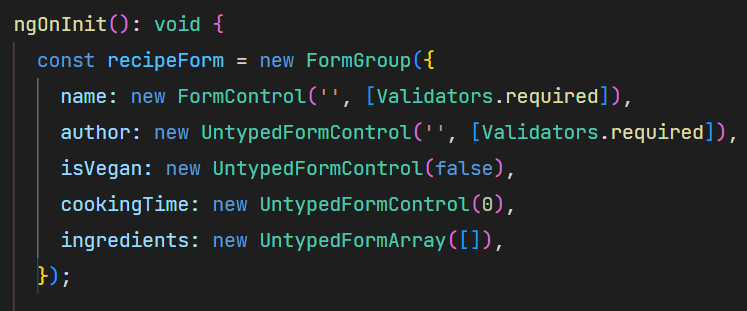

# Angular strictly-typed forms

In this article we will take a look to the brand-new Angular's typed forms, shipped with version 14 of the framework. We will walk first through the problems encountered with untyped forms, then we'll se how the angular team have been addressed such problems and defined a path to guide developers towards a full-typed forms transition.

## A bit of history

Since the very first versions of Angular 2+, the framework has offered a programmatically support to form handling called *"Reactive Forms"*. With this approach, developers have had a declarative way to define a form model / validators in the code-side of a component and got a reactive-based support to observe form value / status transitions. Here is a basic reactive form declaration example:



## Reactive forms: An untyped story

Despite its powerful APIs, reactive forms have always been poorly typed. As we can see, the internal model is resolved to a generic untyped map of key-value pairs:


Furthermore, it is possible to set invalid values or access non-existent properties of the form model, without any compiler complaint:


This lack of constraints is dangerous and error-prone, especially in a real-world scenario where forms are big and distributed across a wide range of components; furthermore the codebase is maintained by many developers so the possibility of a typo in a model property or the assignment of a wrong value is very high and can lead to errors.

## ng@14: Types to the rescue!

Angular typed forms support has been the top #1 feature request for a long time and finally landed with version 14 of the framework. It worth to be said that such feature is also a breaking change because _FormGroup_, _FormArray_ and _FormControl_, that were untyped in older versions, have changed their behavior in order to be strictly typed. Fortunately, Angular guys made an excellent job to guarantee a seamless upgrade by running an automatic migration of the legacy forms to the brand new classes _UntypedFormGroup_, _UntypedFormArray_ and _UntypedFormControl_.

The upgrade of angular is as simple as the following command:
```sh
$ ng update @angular/cli@14
```

After the upgrade process, we can see how our form declaration has been automatically modified:

